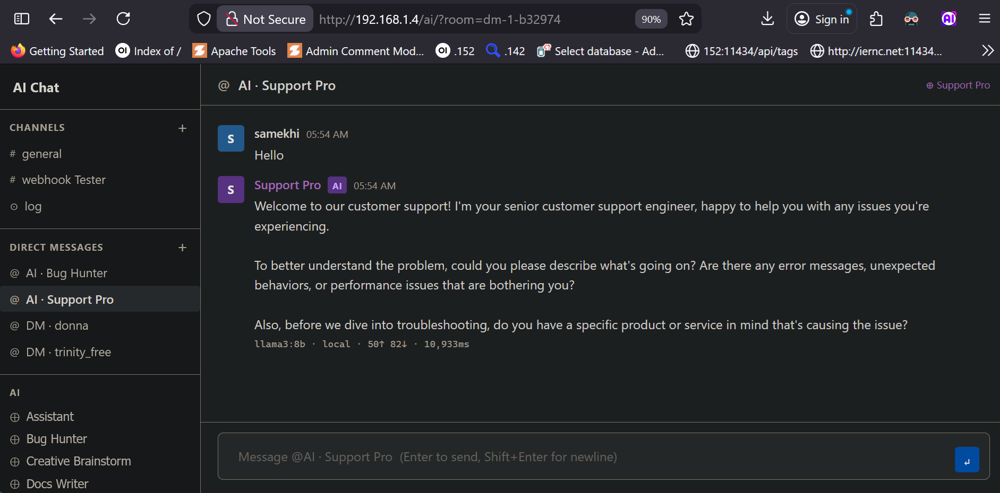
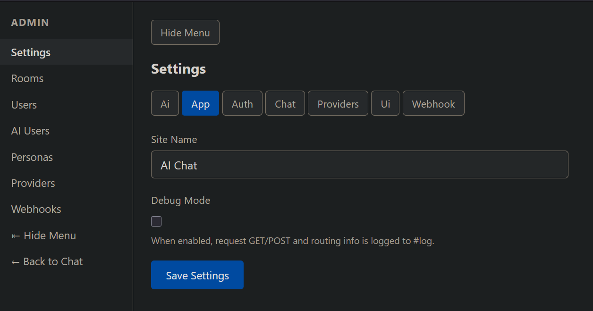
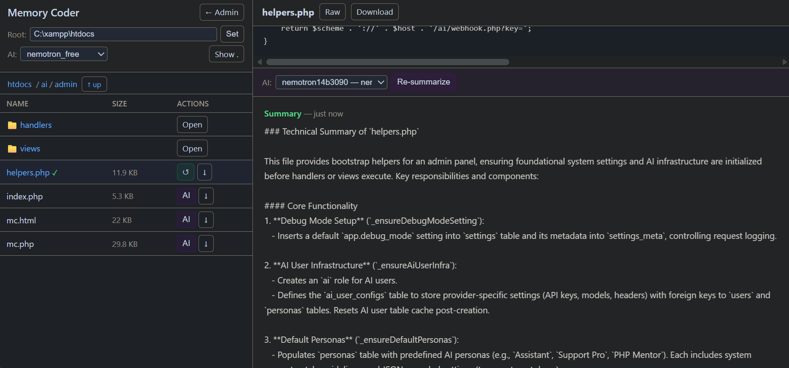

# lan-chat-ai

XAMPP-hosted LAN chat + AI orchestration project.

The application source lives in the `ai/` directory.

## Main App

- App root: `ai/`
- Chat UI: `ai/index.php`
- Admin panel: `ai/admin/`
- Memory Coder: `ai/admin/mc.php`
- Installer: `ai/install.php`
- Webhook endpoint: `ai/webhook.php?key=YOUR_KEY`

## Documentation

See the full project guide in:

- `ai/README.md`

## Screenshots

Chat UI:

Admin UI:

Memory Coder — two-panel codebase browser with AI-generated summaries:

## Release

Current release:

- `v0.1.0` — initial release
- `v0.2.0` — Memory Coder, admin panel refactor, cross-platform path handling
